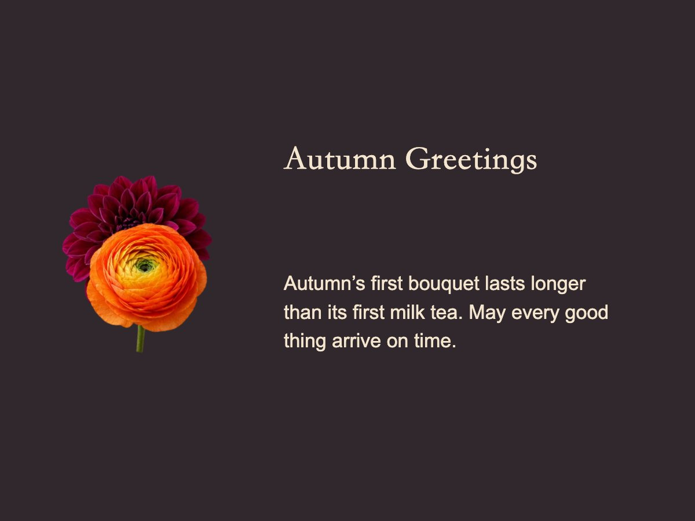

# AI 花艺师 · AI Florist


和 Agent 一起设计一束花。一个纯浏览器端的插花/花束设计工作台，通过 [WebMCP](https://github.com/webmachinelearning/webmcp) 把全部设计能力暴露为可调用的 Agent 工具——用户手动拖动，Agent 编程协作，共享同一份作品。

Design a bouquet together with your agent. A browser-native floral design workbench that exposes every design capability as WebMCP tools — humans drag and drop, agents design programmatically, both share one canvas.

## 效果 Showcase

每束花都是 App 内真实渲染导出，配套贺卡由同一工作台生成。

| 花束 Bouquet | 配套贺卡 Card |
|---|---|
|  |  |
| **奶油蕾丝 / Cream Lace** — 奶油粉白经典款 | "May you grow freely and run toward the life you love." |
|  |  |
| **珍珠百合 / Pearl Lily** — 纯白心意 | "A heart as pure as lilies." |
|  |  |
| **圣诞 · 雪夜松语 / Christmas · Snowfall Letters** — 雪夜松果 | "A light waiting for you." |
|  |  |
| **万圣节 · 暮色南瓜 / Halloween · Pumpkin Twilight** — 橙紫暮色 | "Leave your worries at the door." |
|  |  |
| **秋日叙 · 焦糖时光 / Autumn Ode · Caramel Hours** — 焦糖油画感 | "The first bouquet of autumn lasts longer than the first milk tea." |

## 功能 Features

- **27 套风格与节日花束预设**：奶油蕾丝、建筑直线、自然野趣、克制东方，以及情人节、母亲节、毕业季、圣诞、万圣、中秋、重阳等中西节日
- **元素级编辑**：花材/枝叶/包装/花器/饰品拖动、旋转、缩放、层级、替换，无限画布视角
- **贺卡设计**：1200×900 画布，12 套模板，文字/图片/装饰独立元素，花体、竖排、邮票框、国风等
- **自定义素材库**：上传或直链导入图片，存于浏览器 IndexedDB，备份含原始数据与来源
- **中英双语**:`__KIMI_DESKTOP_ENV__.locale` → `navigator.language` 自动切换
- **16 个 WebMCP 工具**:`floral_brief`、`apply_design`、`present_proposals`、`apply_card_design`、`import_asset`、`export_work` 等

## 技术 Tech

- 零依赖：原生 HTML/CSS/JS(ES modules),Node 20 单文件服务端（仅部署形态需要）
- `npm run build` → `dist/`（缓存戳、静态检查、全栈包）
- 自包含服务端：`server.js`（纯 Node 20 内置模块，静态托管 + 可选 Kimi OAuth 登录）

## 开发 Develop

```bash
python3 -m http.server 8899   # 静态预览 http://127.0.0.1:8899
npm run build                 # 构建到 dist/
node dist/server.js           # 全栈形态本地跑(:3000)
```

## License

MIT（代码）。素材图片（assets/）为本项目专用，不随 MIT 授权再分发。
